**Overview**

- Imports raw gene expression data and metadata into DESeq2 objects
- Performs differential expression analysis
- Visualizes results
- Performs enrichment analysis
- Saves results tables

## Methods

See exact packages below for versions. At a high level we use DESeq2 for differential expression analysis, clusterProfiler for enrichment analysis, and ggplot2 for visualization.

## Analysis Setup

Environment setup

```{r, setup, message = FALSE, warning = FALSE}
library(tidyverse)
library(DESeq2)
library(glue)
library(DT)
library(BiocParallel)
library(patchwork)
library(writexl)
library(tibble)
library(clusterProfiler)
library(enrichplot)
library(org.Mm.eg.db)
library(AnnotationDbi)
library(ggpubr)
library(vegan)

homedir <- "/central/groups/MazmanianLab/joeB"
wkdir <- glue("{homedir}/RNASEQ/fprau_bulk")
input_dir <- glue("{wkdir}/data/input")
interim_dir <- glue("{wkdir}/data/interim")
results_dir <- glue("{wkdir}/data/results")
fig_dir <- glue("{wkdir}/figures")

BiocParallel::register(BiocParallel::MulticoreParam(6))
```

Prepping DESeq2 object

```{r, eval = FALSE}
# Loading metadata
meta <- read_csv(glue("{input_dir}/metadata_BulkRNASeq_Samples_AM.csv")) %>% 
  janitor::clean_names() %>% 
  mutate(group = glue("{genotype} {treatment}")) %>%
  mutate(group = factor(group, levels = c("ASO Vehicle", "WT Vehicle", "ASO Fp"))) %>%
  mutate_at(vars(extraction_date, collection_date), lubridate::mdy) %>%
  glimpse()

# Examing the metadata
DT::datatable(meta)
```

**MID BRAIN**

- extraction date all the same
- cage coincides w/ conditions, - not a helpful covar in this case
- collection date is even across conditions - useful var to check for batch effects
- all mice are from the same cohort

**LARGE INTESTINE**

- cohort, cage, extraction date, collection date all might be useful covars


```{r, eval = FALSE}
# Loading gene expression data
gex <- read_csv(glue("{input_dir}/20250416_ParkinsonsAVW_rawcounts.csv")) %>% 
  glimpse()
gene_map <- gex %>% dplyr::select(gene_id, gene_name, gene_type) %>% distinct()

gene_mat <- gex %>% 
  column_to_rownames(var = "gene_id") %>%
  select(-c(gene_name, gene_type)) %>%
  as.matrix()

meta_gi <- meta %>% filter(tissue == "Large intestine") %>% 
  mutate_at(vars(genotype, treatment, cohort, cage_number), as.factor)
rownames(meta_gi) <- meta_gi$sample_id

meta_mb <- meta %>% filter(tissue == "Mid Brain") %>% 
  mutate_at(vars(genotype, treatment, cohort, cage_number), as.factor)
rownames(meta_mb) <- meta_mb$sample_id

# Creating DESeq2 object
# DeSeq2 is unable to fit the glm when more than one factor is included in the design
dds_mb <- DESeqDataSetFromMatrix(countData = gene_mat[,rownames(meta_mb)],
                              colData = meta_mb,
                              design = ~ group
                              )

dds_gi <- DESeqDataSetFromMatrix(countData = gene_mat[,rownames(meta_gi)],
                              colData = meta_gi,
                              design = ~ group
                              )

```

Minor pre-filtering - removing genes with total sum across samples <= 10 counts

```{r, eval = FALSE}
nrow(dds_mb)
dds_mb <- dds_mb[rowSums(counts(dds_mb)) >= 10, ]
nrow(dds_mb)
# 78298 to 47018 genes remaining

nrow(dds_gi)
dds_gi <- dds_gi[rowSums(counts(dds_gi)) >= 10, ]
nrow(dds_gi)
# 78298 to 41317 genes remaining
```


## Differential Expression Analysis

Running DESeq2 will perform the following key steps:


- Estimation of size factors

- Estimation of dispersion

- Negative Binomial GLM fitting and Wald statistic

```{r, eval = FALSE}
dds_mb <- DESeq(dds_mb)
dds_mb

dds_gi <- DESeq(dds_gi)
dds_gi
```


```{r, eval = FALSE}
comps <- tribble(
    ~numerator, ~denominator,
    "WT Vehicle", "ASO Vehicle",
    "ASO Fp", "WT Vehicle",
    "ASO Fp", "ASO Vehicle"
)

res_mb <- list()
res_gi <- list()
for (i in 1:nrow(comps)) {
  vs <- glue("{comps$numerator[i]}_vs_{comps$denominator[i]}") %>% gsub(" ", "_", .)
    message(glue(
        "Calculating differential expression for ",
        "{comps$numerator[i]} vs {comps$denominator[i]}"
    ))
    res_mb[[vs]] <- results(
        dds_mb,
        contrast = c("group", comps$numerator[i], comps$denominator[i])
    )
    res_gi[[vs]] <- results(
        dds_gi,
        contrast = c("group", comps$numerator[i], comps$denominator[i])
    )
}

saveRDS(dds_mb, glue("{interim_dir}/deseq2_mb_{Sys.Date()}.rds"))
saveRDS(dds_gi, glue("{interim_dir}/deseq2_gi_{Sys.Date()}.rds"))
saveRDS(res_mb, glue("{interim_dir}/deseq2_mb_res_{Sys.Date()}.rds"))
saveRDS(res_gi, glue("{interim_dir}/deseq2_gi_res_{Sys.Date()}.rds"))

```


## Visualizing results

Reading in processed results
```{r, eval = FALSE}
dds_mb <- readRDS(glue("{interim_dir}/deseq2_mb_2025-05-09.rds"))
dds_gi <- readRDS(glue("{interim_dir}/deseq2_gi_2025-05-09.rds"))
res_mb <- readRDS(glue("{interim_dir}/deseq2_mb_res_2025-05-09.rds"))
res_gi <- readRDS(glue("{interim_dir}/deseq2_gi_res_2025-05-09.rds"))
```


Visualzing p-value histograms

plotting funcs
```{r, eval = FALSE}
plot_pval_hist <- function(res) {
  title = res@elementMetadata$description[5]
  res %>%
    as.data.frame() %>%
    ggplot(aes(x = pvalue)) +
    geom_histogram(binwidth = 0.01) +
    theme_minimal() +
    ggtitle(title)
}

plot_volcano <- function(res) {
    title <- res@elementMetadata$description[5]

    title <- res@elementMetadata$description[5] %>%
        strex::str_after_first("group ")
    numerator_group <- title %>% strex::str_before_first(" vs ")
    denominator_group <- title %>% strex::str_after_first(" vs ")
    color_pal <- c("#EF433D", "#06A0DD", "gray80")
    names(color_pal) <- c(
        glue("{numerator_group} Up"),
        glue("{denominator_group} Up"),
        "ns"
    )

    # Convert to dataframe and add gene symbols
    plot_df <- res %>%
        as.data.frame() %>%
        drop_na(padj) %>%
        rownames_to_column(var = "gene_id") %>%
        left_join(gene_map, by = "gene_id") %>%
        mutate(sig = case_when(
            padj <= 0.05 & log2FoldChange > 0.2 ~ glue("{numerator_group} Up"),
            padj <= 0.05 & log2FoldChange < -0.2 ~ glue("{denominator_group} Up"),
            TRUE ~ "ns"
        ))

    # Identify top 10 genes by significance (lowest padj)
    top_genes <- plot_df %>%
      filter(sig !="ns") %>% 
        filter(padj < 0.05) %>%
        arrange(padj) %>%
        head(15)

    # Create the plot with labels
    ggplot(plot_df, aes(x = log2FoldChange, y = -log10(padj), color = sig)) +
        geom_point(alpha = 0.75) +
        theme_bw() +
        ggtitle(title) +
        scale_color_manual(values = color_pal) +
        theme(legend.position = "bottom") +
        theme(plot.title = element_text(hjust = 0.5)) +
        labs(color = NULL, y = expression(-log[10](padj)), x = expression(log[2](Fold~Change))) +
        geom_hline(yintercept = -log10(0.05), linetype = "dotted") +
        geom_vline(xintercept = 0.2, linetype = "dotted") +
        geom_vline(xintercept = -0.2, linetype = "dotted") +
        # Add ggrepel labels for top genes
        ggrepel::geom_text_repel(
            data = top_genes,
            aes(label = gene_name),
            size = 3,
            max.overlaps = Inf,
            force = 50,
            force_pull = 0,
            nudge_x = ifelse(top_genes$log2FoldChange > 0, 1, -1),
            nudge_y = 1,
            box.padding = 0.8,
            point.padding = 0.5,
            segment.color = "grey",
            segment.size = 0.2,
            segment.alpha = 0.75,
            direction = "both",
            # Add these parameters for curved segments:
            segment.curvature = 0.3, # Controls how curved the lines are (0 = straight)
            segment.ncp = 3, # Number of control points (higher = smoother curves)
            segment.angle = 10 # Angle of the curve
        )
}

#' To run in parallel with plotPCA - 
#' designed to copy default filtering of DESeq2::plotPCA
#' 
#' @param vsd DESeq2::vst object
#' @param intgroup column name in colData(vsd) to use for grouping
#' @param ntop number of top variable genes to use
#' @param method distance method for PERMANOVA
#' @param nperm number of permutations for PERMANOVA

run_adonis <- function(vsd, intgroup = "group", ntop = 500, method = "euclidean", nperm = 9999) {
  # Get top variable genes
  rv <- rowVars(assay(vsd))
  select <- order(rv, decreasing = TRUE)[seq_len(min(ntop, length(rv)))]

  # Transpose expression matrix (samples × genes)
  expr_mat <- t(assay(vsd)[select, ])

  # Extract metadata
  if (!intgroup %in% colnames(colData(vsd))) {
    stop("intgroup must be a column in colData(vsd)")
  }
  meta <- as.data.frame(colData(vsd)[, intgroup, drop = FALSE])
  colnames(meta) <- "Group"  # simplify formula building

  # Run PERMANOVA
  adonis2_result <- vegan::adonis2(
    expr_mat ~ Group, data = meta, method = method, permutations = nperm
    )

  return(adonis2_result)
}

```

### P-value Distributions

```{r, eval = FALSE}
p_hist_mb <- res_mb %>% 
  purrr::map(~plot_pval_hist(.x))
p_hist_gi <- res_gi %>% 
  purrr::map(~plot_pval_hist(.x))

p_hist_mb_patch <- p_hist_mb %>% purrr::reduce(`/`) + plot_layout(ncol = 1)
p_hist_gi_patch <- p_hist_gi %>% purrr::reduce(`/`) + plot_layout(ncol = 1)

ggsave(p_hist_mb_patch, 
  filename = glue("{fig_dir}/deseq2_mb_pval_hist.png"), width = 6, height = 10)
ggsave(p_hist_gi_patch, 
  filename = glue("{fig_dir}/deseq2_gi_pval_hist.png"), width = 6, height = 10)

```


::::{.grid}
:::{.g-col-6 .text-center}
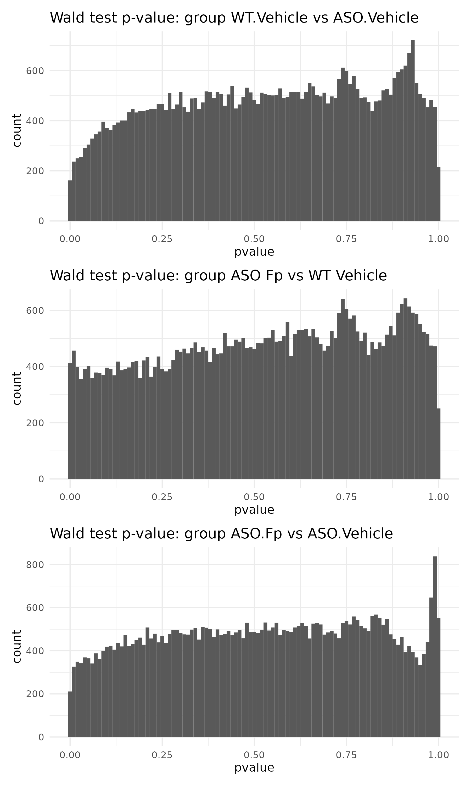{width="95%"}
:::
:::{.g-col-6 .text-center}
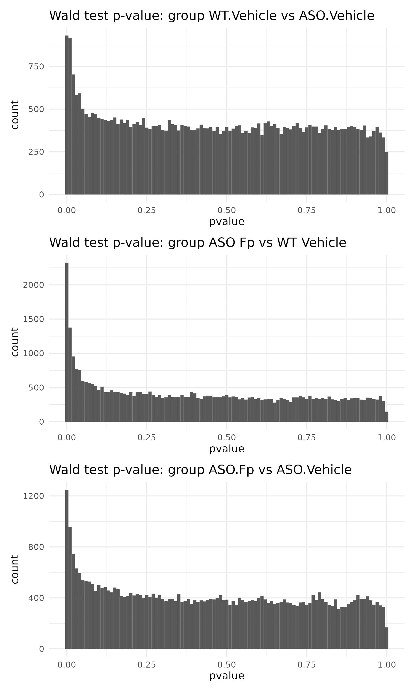{width="95%"}
:::
::::


**Takeaways - P-value Distributions**

- P-value distributions are robust for Large Intestine, but not for Mid Brain - which seem to point towards a null hypothesis.


### Dimension Reduction - PCA

```{r, eval = FALSE}
vsd_mb <- vst(dds_mb, blind=FALSE)
vsd_gi <- vst(dds_gi, blind=FALSE)

adonis_mb <- run_adonis(vsd_mb)
adonis_gi <- run_adonis(vsd_gi)

# DESeq2::plotPCA(vsd_mb, intgroup=c("group")) # viewing explained variance numbers

p_pca_mb <- DESeq2::plotPCA(vsd_mb, intgroup=c("group"), returnData = TRUE) %>% 
  ggplot(aes(x = PC1, y = PC2, color = group)) +
  geom_point(size = 3) +
  theme_bw() +
  coord_fixed() +
  ggtitle("Mid Brain") +
  labs(x = "PC1: 28% variance", y = "PC2: 13% variance", color = NULL) +
  stat_ellipse(geom="polygon", level=0.95, alpha=0) +
  annotate(
    "text",
    x = Inf, y = 0,         # right side, center vertically
    hjust = 1.3, vjust = - 3.5, size = 3,
    label = glue(
      "PERMANOVA\nR² = {round(adonis_mb$R2[1], 2)}\n",
      "p = {formatC(adonis_mb$`Pr(>F)`[1], format = 'e', digits = 2)}"
    )
  ) +
  scale_color_manual(
    values = c("ASO Vehicle" = "#A6CEE3", "ASO Fp" = "#1F78B4", "WT Vehicle" = "#B2DF8A"),
    limits = c("ASO Vehicle", "ASO Fp", "WT Vehicle")
  )

# BiocGenerics::plotPCA(vsd_gi, intgroup=c("group")) # viewing explained variance numbers

p_pca_gi <- plotPCA(vsd_gi, intgroup=c("group"), returnData = TRUE) %>% 
  ggplot(aes(x = PC1, y = PC2, color = group)) +
  geom_point(size = 3) +
  theme_bw() +
  coord_fixed() +
  labs(x = "PC1: 18% variance", y = "PC2: 11% variance", color = NULL) +
  ggtitle("Large Intestine") +
  stat_ellipse(geom="polygon", level=0.95, alpha=0) +
  annotate(
    "text",
    x = Inf, y = 0,         # right side, center vertically
    hjust = 1.3, vjust = - 3.5, size = 3,
    label = glue(
      "PERMANOVA\nR² = {round(adonis_gi$R2[1], 2)}\n",
      "p = {formatC(adonis_gi$`Pr(>F)`[1], format = 'e', digits = 2)}"
    )
  ) +
  scale_color_manual(
    values = c("ASO Vehicle" = "#A6CEE3", "ASO Fp" = "#1F78B4", "WT Vehicle" = "#B2DF8A"),
    limits = c("ASO Vehicle", "ASO Fp", "WT Vehicle")
  )

ggsave(p_pca_mb, 
  filename = glue("{fig_dir}/deseq2_mb_pca.png"), width = 6, height = 5)
ggsave(p_pca_gi, 
  filename = glue("{fig_dir}/deseq2_gi_pca.png"), width = 6, height = 5)

```


**Results for PERMANOVA**


```{r}
# - Mid Brain

# Permutation test for adonis under reduced model
# Terms added sequentially (first to last)
# Permutation: free
# Number of permutations: 9999

# vegan::adonis2(formula = expr_mat ~ Group, data = meta, permutations = nperm, method = method)
#          Df SumOfSqs      R2      F Pr(>F)  
# Group     2    742.1 0.21935 1.6859  0.025 *
# Residual 12   2641.1 0.78065                
# Total    14   3383.2 1.00000                
# ---
# Signif. codes:  0 ‘***’ 0.001 ‘**’ 0.01 ‘*’ 0.05 ‘.’ 0.1 ‘ ’ 1


# - Large Intestine

# Permutation test for adonis under reduced model
# Terms added sequentially (first to last)
# Permutation: free
# Number of permutations: 9999

# vegan::adonis2(formula = expr_mat ~ Group, data = meta, permutations = nperm, method = method)
#          Df SumOfSqs      R2      F Pr(>F)    
# Group     2   1242.5 0.18193 1.8903  3e-04 ***
# Residual 17   5586.8 0.81807                  
# Total    19   6829.3 1.00000                  
# ---
# Signif. codes:  0 ‘***’ 0.001 ‘**’ 0.01 ‘*’ 0.05 ‘.’ 0.1 ‘ ’ 1


```


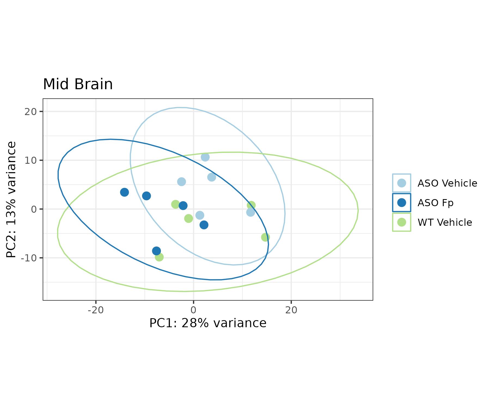{width="95%"}
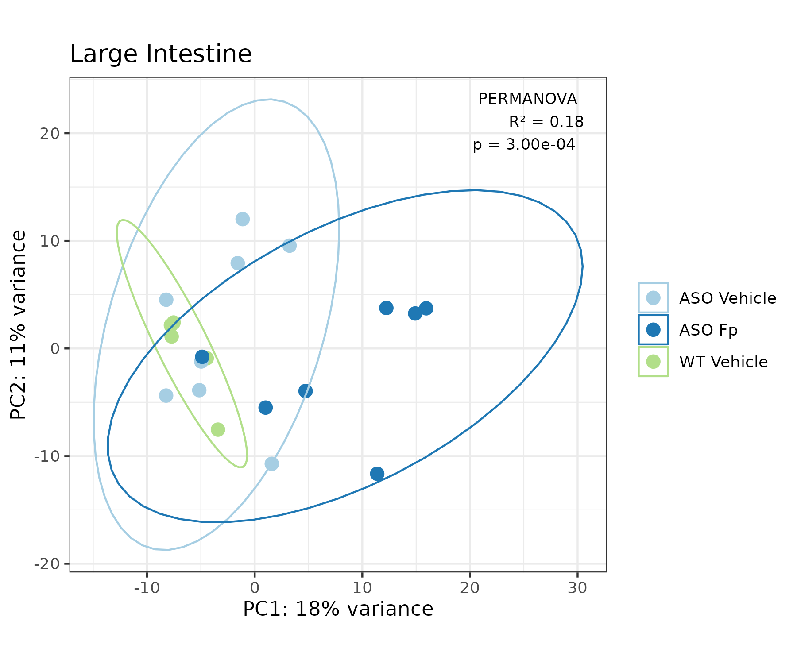{width="95%"}


**Takeaways - PCA**

- PCA plots show some separation between conditions, but differences are modest. There is substantial similarity between a handful of some samples across conditions in each tissue.


### Volcano Plots

```{r, eval = FALSE}
volcano_figs <- glue("{fig_dir}/DESeq2_VolcanoPlots")
dir.create(volcano_figs, showWarnings = FALSE, recursive = TRUE)

for (comp in names(res_gi)) {
  p_vol_gi <- res_gi[[comp]] %>% plot_volcano()
  p_vol_mb <- res_mb[[comp]] %>% plot_volcano()
  ggsave(
      p_vol_gi,
      filename = glue("{volcano_figs}/GI_volcano_{comp}.png"),
      width = 5,
      height = 5
  )
  ggsave(
      p_vol_mb,
      filename = glue("{volcano_figs}/MB_volcano_{comp}.png"),
      width = 5,
      height = 5
  )
}

```

::: {layout-nrow=1}
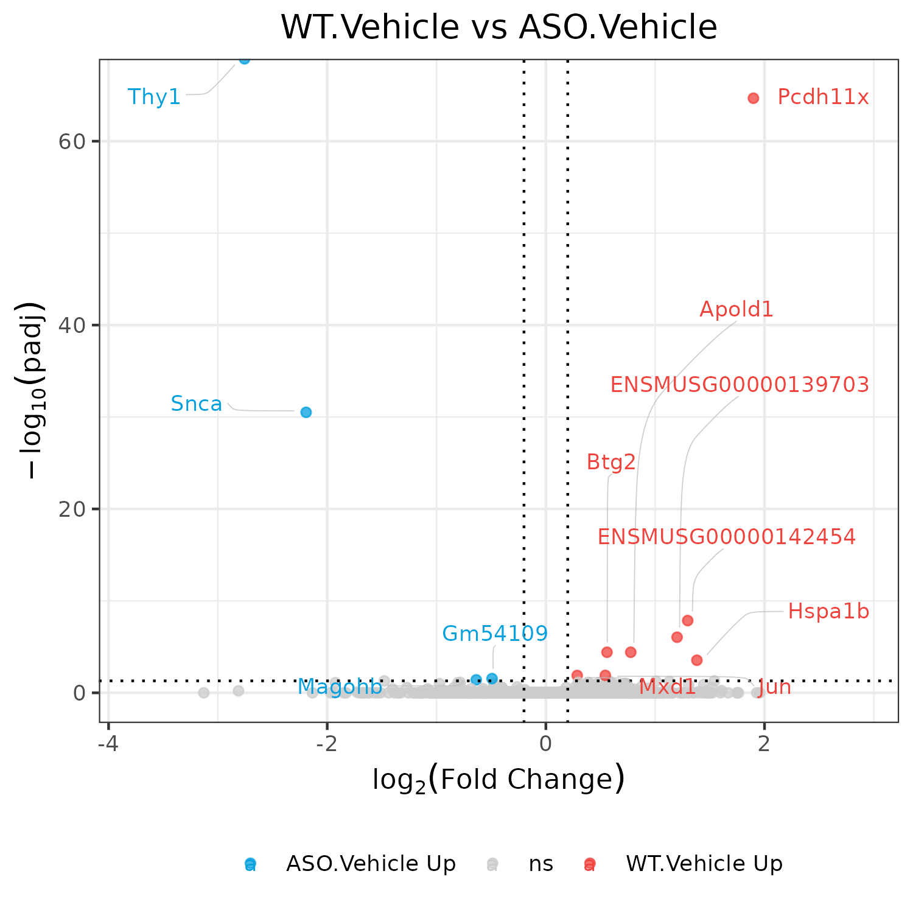

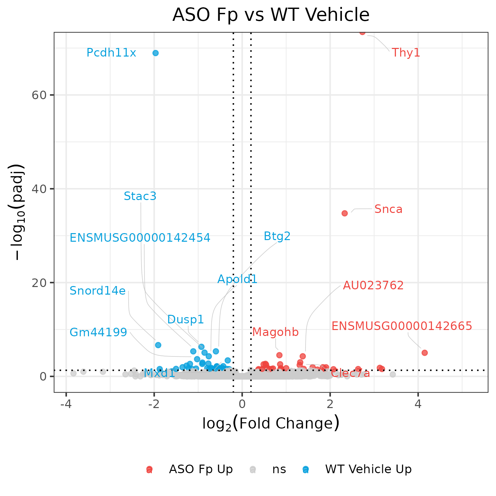

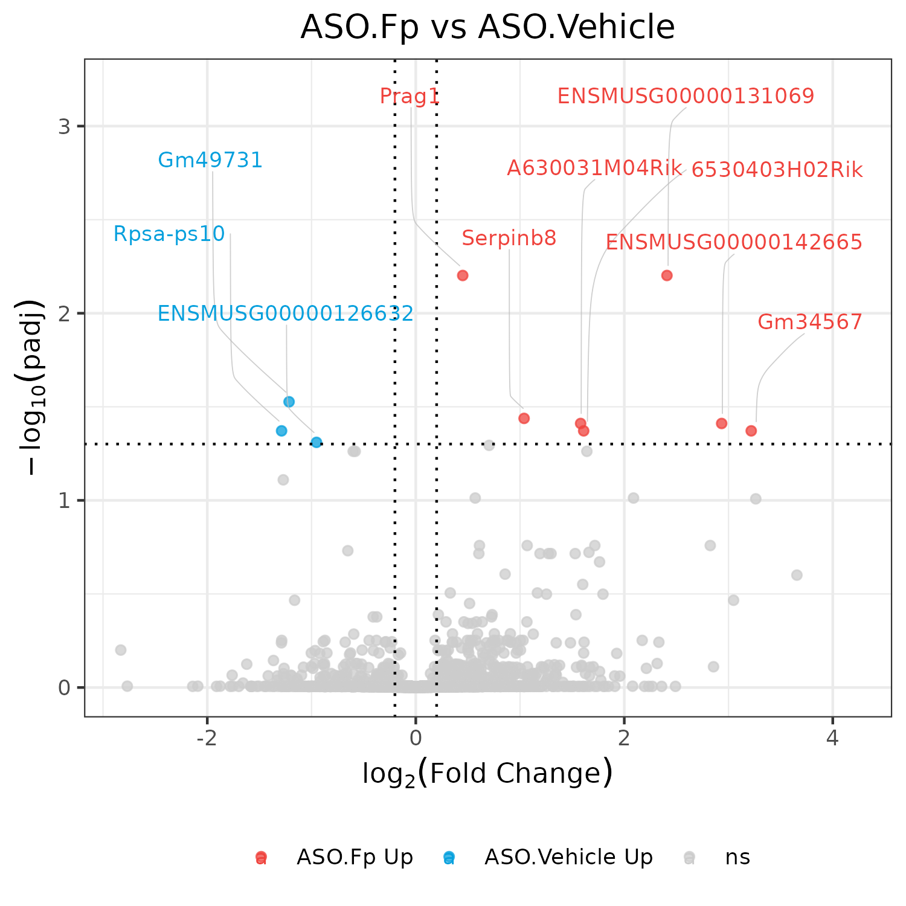

:::


::: {layout-ncol=3}
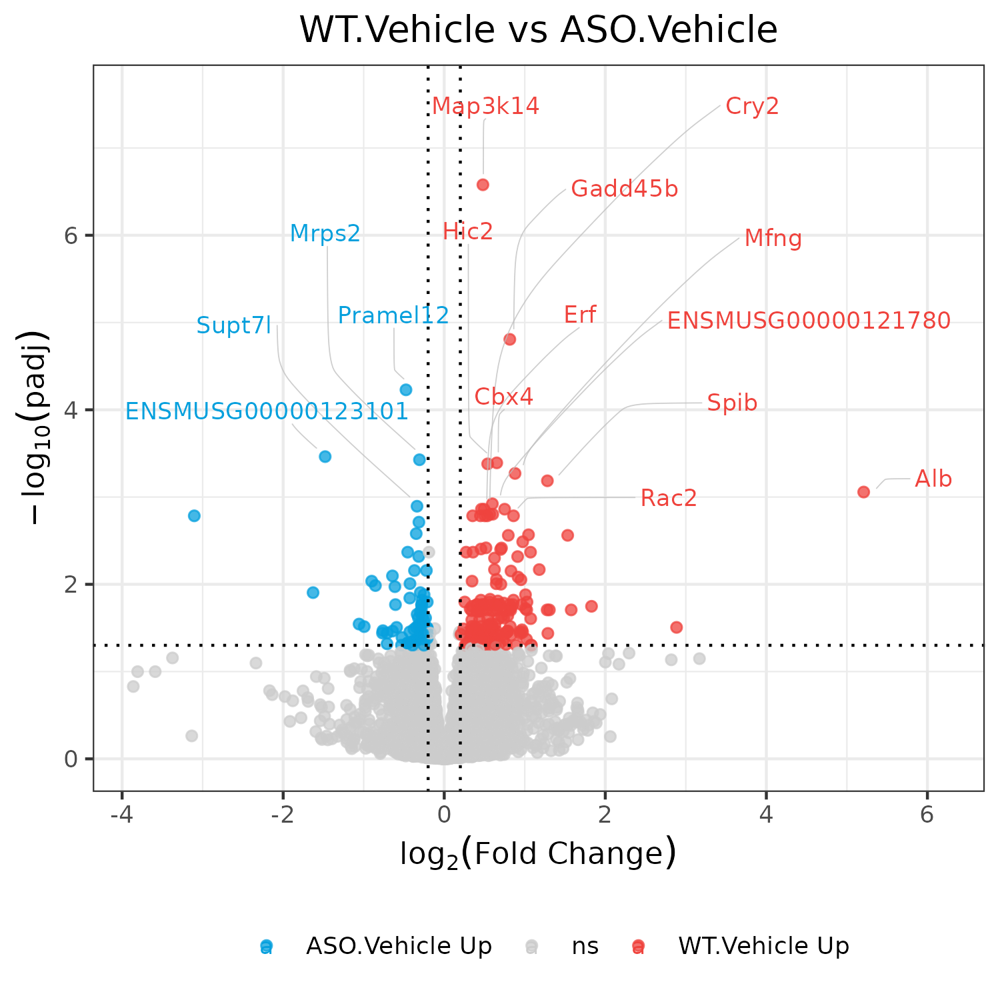

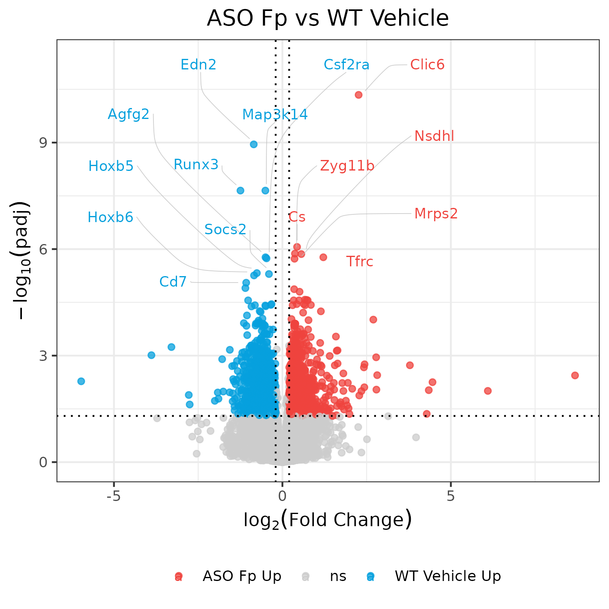

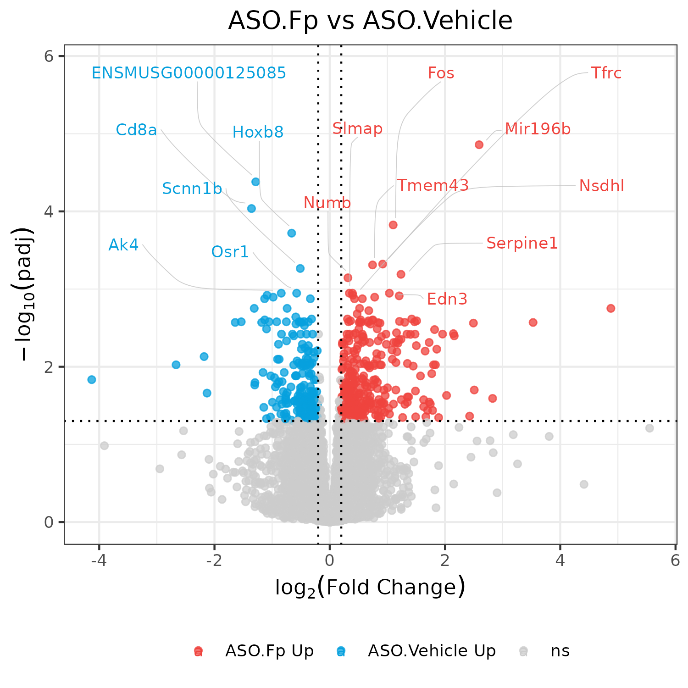
:::


Heatmap to visualize differences between conditions for main DEGS between ASO Fp vs ASO Vehicle and WT Vehicle vs ASO Vehicle

```{r}
library(DESeq2)
library(dplyr)
library(pheatmap)
library(viridis)
library(RColorBrewer)

# select_genes <- order(rowMeans(counts(dds_gi, normalized=TRUE)),
#                 decreasing=TRUE)[1:40]

heatmap_meta <- as.data.frame(colData(dds_gi)[,c("group", "genotype")])

# pheatmap(assay(dds_gi)[select_genes,],
#   cluster_rows=TRUE,
#   show_rownames=TRUE,
#   cluster_cols=TRUE,
#   annotation_col=heatmap_meta
#   )


# 1. Get top 25 DE genes from specific contrast
top_genes <- res_gi[["ASO_Fp_vs_ASO_Vehicle"]] %>%
  as.data.frame() %>%
  tibble::rownames_to_column("gene_id") %>%
  arrange(padj) %>%
  filter(!is.na(padj)) %>%
  slice_head(n = 25) %>%
  pull(gene_id)

# 2. Replace Ensembl IDs with gene symbols
gene_map_clean <- gene_map %>%
  mutate(gene_id = sub("\\..*", "", gene_id))  # Remove version suffix
top_genes_clean <- sub("\\..*", "", top_genes)
gene_symbols <- gene_map_clean %>%
  filter(gene_id %in% top_genes_clean) %>%
  distinct(gene_id, gene_name)
# Ensure rownames match the matrix rownames
mat <- assay(dds_gi)[top_genes, ] %>% log1p()  # 2. log-scale
# 1. Rename rownames to gene symbols
rownames(mat) <- gene_symbols$gene_name[match(sub("\\..*", "", rownames(mat)), gene_symbols$gene_id)]

# Define custom annotation colors
annotation_colors <- list(
  genotype = setNames(brewer.pal(length(unique(heatmap_meta$genotype)), "Paired"),
                      unique(heatmap_meta$genotype)),
  group = setNames(viridis(length(unique(heatmap_meta$group)), option = "E"),  # D is default viridis
                   unique(heatmap_meta$group))
)

# Plot with magma color scale
# breaks <- pretty(range(mat), n = 5)

pheat <- pheatmap(
  mat,
  cluster_rows = TRUE,
  cluster_cols = TRUE,
  show_rownames = TRUE,
  annotation_col = heatmap_meta,
  annotation_colors = annotation_colors,
  color = viridis::viridis(100, option = "mako")
)


ggsave(pheat, filename = glue("{fig_dir}/heatmap_gi_top_genes.png"), width = 7, height = 5.5)

```


Visualzing similarities in gene expression shifts between conditions

```{r, eval = FALSE}
names(res_gi)
wt_v_asoc <- res_gi[["WT_Vehicle_vs_ASO_Vehicle"]] %>% 
  as.data.frame() %>% 
  mutate(sig = case_when(
    padj <= 0.05 & log2FoldChange > 0.2 ~ "Up",
    padj <= 0.05 & log2FoldChange < -0.2 ~ "Down",
    TRUE ~ "ns"
  )) %>% 
  dplyr::rename_all( ~ paste0(., "__wt_v_asoc")) %>% 
  rownames_to_column(var = "gene_id")
asofp_v_asoc <- res_gi[["ASO_Fp_vs_ASO_Vehicle"]] %>% 
  as.data.frame() %>% 
  mutate(sig = case_when(
    padj <= 0.05 & log2FoldChange > 0.2 ~ "Up",
    padj <= 0.05 & log2FoldChange < -0.2 ~ "Down",
    TRUE ~ "ns"
  )) %>% 
  dplyr::rename_all( ~ paste0(., "__asofp_v_asoc")) %>% 
  rownames_to_column(var = "gene_id")


df_comb <- full_join(wt_v_asoc, asofp_v_asoc) %>% 
  left_join(gene_map, by = "gene_id") %>% 
  mutate(sig_comb = case_when(
    sig__wt_v_asoc == "Up" & sig__asofp_v_asoc == "Up" ~ "WT & ASO Fp Up",
    sig__wt_v_asoc == "Down" & sig__asofp_v_asoc == "Down" ~ "WT & ASO Fp Down",
    TRUE ~ "Mixed"
  )) %>% 
  drop_na(pvalue__wt_v_asoc, pvalue__asofp_v_asoc) %>% 
  glimpse()

df_comb$sig_comb %>% table()
top_genes <- df_comb %>%
  filter(sig_comb != "Mixed")
df_comb %>% glimpse()

color_pal <- c("#EF433D", "#06A0DD", "gray80")
names(color_pal) <- c("WT & ASO Fp Up", "WT & ASO Fp Down", "Mixed")

set.seed(123)
p_comb <- df_comb %>%
  drop_na(log2FoldChange__wt_v_asoc, log2FoldChange__asofp_v_asoc) %>%
  # Reorder the factor levels to make "Mixed" appear first (below other points)
  mutate(sig_comb = factor(sig_comb, levels = c("Mixed", "WT & ASO Fp Up", "WT & ASO Fp Down"))) %>%
  arrange(sig_comb) %>% 
  ggplot(aes(x = log2FoldChange__wt_v_asoc, y = log2FoldChange__asofp_v_asoc)) +
  geom_point(aes(color = sig_comb), alpha = 0.75) +
  # geom_abline(slope = 1, linetype = "dotted") +  # y ~ x line
  # geom_abline(slope = -1, linetype = "dotted") +  # y ~ -x line
  scale_color_manual(values = color_pal) +
  labs(
    color = NULL,
    x = expression(log[2](Fold~Change[WT~Vehicle~vs~ASO~Vehicle])),
    y = expression(log[2](Fold~Change[ASO~Fp~vs~ASO~Vehicle])),
    color = NULL
  ) +
  geom_smooth(method = "lm", se = TRUE, color = "black") +
  ggpubr::stat_cor(
     aes(label = paste(..r.label.., ..p.label.., sep = "~`,`~")),
    method = "pearson", label.x = -5, label.y = 5, na.rm = TRUE
    ) +
  ggrepel::geom_label_repel(
    data = top_genes,
    aes(label = gene_name, color = sig_comb),
    size = 3,
    max.overlaps = Inf,
    force = 5,
    force_pull = 0,
    nudge_x = ifelse(top_genes$log2FoldChange > 0, 1, -1),
    nudge_y = 1,
    box.padding = 0.8,
    point.padding = 0.5,
    segment.color = "black",
    segment.size = 0.2,
    segment.alpha = 0.6,
    direction = "both",
    # Add these parameters for curved segments:
    segment.curvature = 0.3, # Controls how curved the lines are (0 = straight)
    segment.ncp = 3, # Number of control points (higher = smoother curves)
    segment.angle = 10 # Angle of the curve
) +
  coord_fixed() +
  theme_bw()

ggsave(
  p_comb,
  filename = glue("{fig_dir}/cross_condition_L2fc_scatter.png"),
  width = 7,
  height = 5
)

```


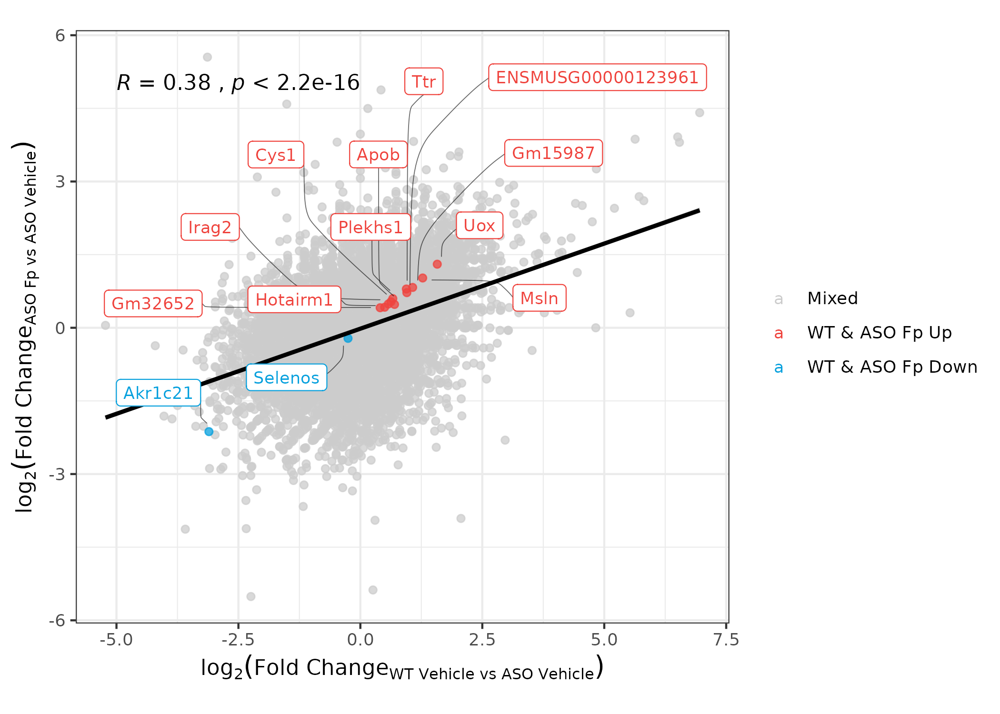{width="95%"}

**Takeaways - Cross Condition L2FC Scatter**

- Cross condition L2FC scatter plot highlights a handful of genes that are enriched in two comparisons of interest in the same direction. 1 - Up in WT compared to ASO Vehicle, 2 - Up in ASO Fp compared to ASO Vehicle. We correlated the log2fc of all genes retained in the DESeq2 analysis and observe a significant positive correlation between the two conditions - suggesting that F. prausnitzii treatment in ASO shifts the large intestine expression profile towards the WT Vehicle profile with respect to an altered ASO Vehicle background. Points that are colored pass significance in both comparisons are highlighted with a label.


## Enrichment Analysis

```{r, eval = FALSE}
source(glue("{wkdir}/notebook/R_scripts/quick_enrich.R"))
gofigs <- glue("{fig_dir}/GO_enrichment")
godata <- glue("{interim_dir}/GO_enrichment")
# dir.create(godata, showWarnings = FALSE, recursive = TRUE)

for (ont_type in c("BP")) {
  for (comp in names(res_gi)) {
    message(glue("Running enrichment analysis for {comp}"))  
    enrich_out_gi <- run_GO_enrich(
      res = res_gi[[comp]],
      alpha = 0.1,
      lfc = 0.2,
      ont = ont_type,
      top_n = 20,
      plot_file = glue("{gofigs}/GO_dotplot_GI_{comp}_{ont_type}.png")
    )
    saveRDS(enrich_out_gi, glue("{godata}/enrich_out_GI_{comp}_{ont_type}_{Sys.Date()}.rds"))
    
    enrich_out_mb <- run_GO_enrich(
      res = res_mb[[comp]],
      alpha = 0.1,
      lfc = 0.2,
      ont = ont_type,
      top_n = 20,
      plot_file = glue("{gofigs}/GO_dotplot_MB_{comp}_{ont_type}.png")
    )
    saveRDS(enrich_out_mb, glue("{godata}/enrich_out_MB_{comp}_{ont_type}_{Sys.Date()}.rds"))

  }
}

```


**Large Intestine**

::: {layout-ncol=3}

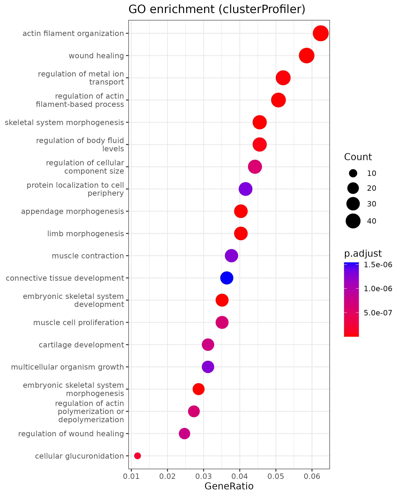

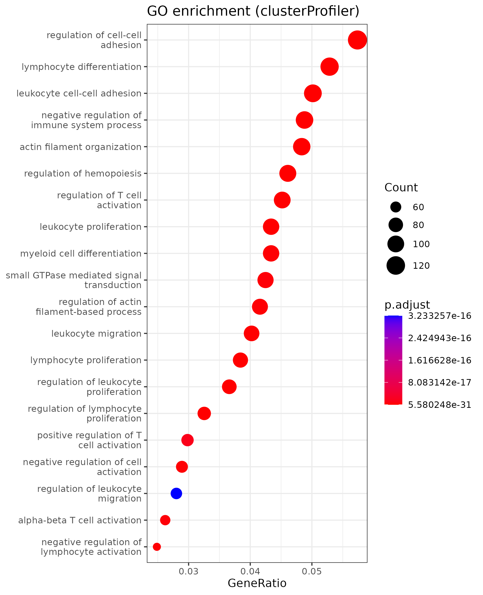

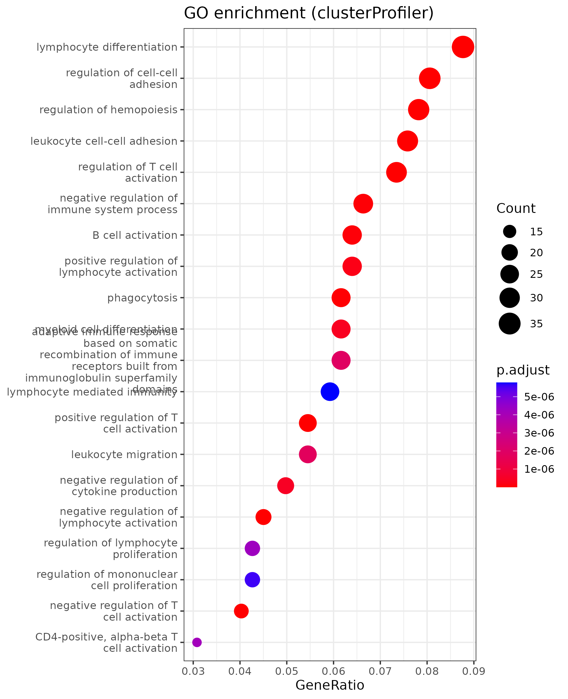
:::

**Mid Brain**

::: {layout-ncol=2}

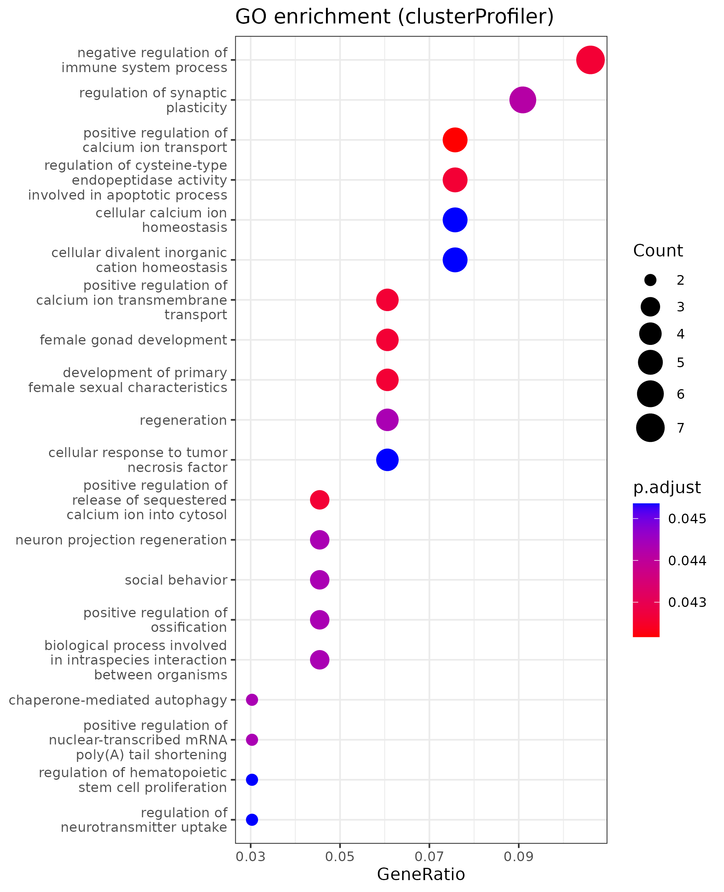

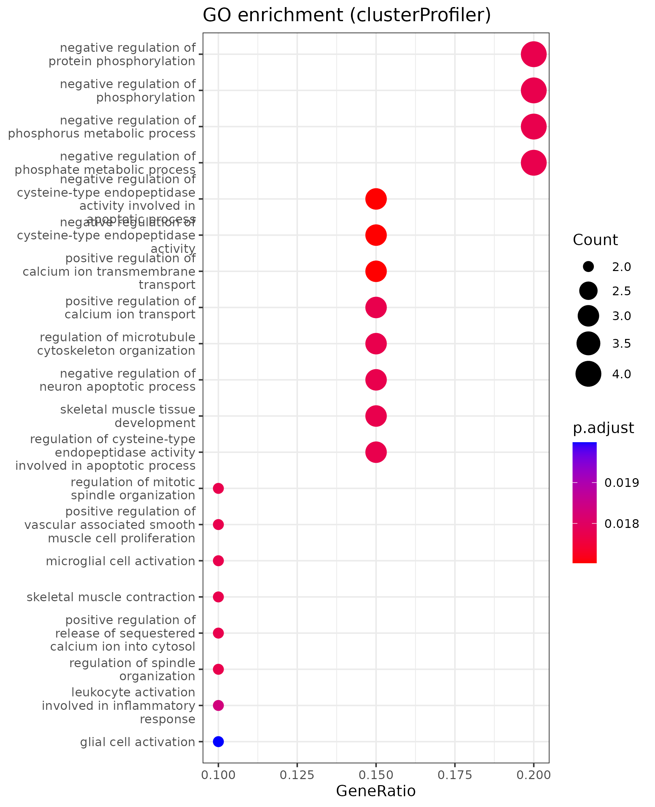
:::


**Takeaways - GO Enrichment**

- GO enrichment analysis shows robust hits for the Large Intestine, but not for the Mid Brain. 

- GO analysis of the large intenstine show some interesting results - 
  1) the ASO Fp vs ASO Vehicle contrast (left panel) is enriched for actin-filament organisation, wound healing, skeletal morphogenesis and cartilage development, pointing to cytoskeletal re-arrangement and tissue-repair pathways rather than immune activation. This suggests that the F. prausnitzii ASO is inducing a "healing" response.
  2) Immune pathways dominate whenever the WT background is involved – both contrasts that include WT animals (centre and right panels) rank lymphocyte activation/differentiation, leukocyte migration, and regulation of immune-system processes at the very top, indicating that genotype (WT vs ASO) is primarily distinguished by immune gene programmes.
  3) The WT Vehicle vs ASO Vehicle comparison shows the strongest proportional shift – its GeneRatio values climb to ~0.09 (higher than the ≤ 0.06 seen in the other two plots), suggesting that baseline genetic difference out-weighs Fp treatment in terms of the fraction of genes hitting each GO term.
  4) Cell–cell adhesion appears as a shared immune theme, absent from the Fp-only contrast – terms such as "regulation of cell-cell adhesion" and "leukocyte cell–cell adhesion" recur in the two immune-heavy panels but not in the Fp-vehicle panel, underscoring that adhesion/trafficking of immune cells is a WT/ASO signature rather than a direct consequence of Fp treatment.


## Saving Results Tables

```{r, eval = FALSE}
# Convert DESeq2 results to data frame
format_results_df <- function(res) {
  df <- res %>% 
    as.data.frame() %>%
    rownames_to_column(var = "gene_id") %>% 
    left_join(gene_map, by = "gene_id") %>%
    glimpse()
  return(df)
}

gi_res_list <- res_gi %>% purrr::map(~format_results_df(.x))
mb_res_list <- res_mb %>% purrr::map(~format_results_df(.x))

# Write to Excel file
write_xlsx(gi_res_list, path = glue("{results_dir}/DESeq2_GI_results.xlsx"))
write_xlsx(mb_res_list, path = glue("{results_dir}/DESeq2_MB_results.xlsx"))

# Saving GO enrichment results
godata_files <- list.files(godata, full.names = TRUE, pattern = "2025-05-10.rds")

godata_list <- godata_files %>% 
  purrr::set_names(basename(.)  %>% gsub("enrich_out_|_2025-05-10.rds", "", .)) %>% 
  purrr::map(~readRDS(.x)$results %>% as.data.frame())

# Convert list of lists to a single data frame
write_xlsx(godata_list, path = glue("{results_dir}/GO_enrichment_results.xlsx"))

```


**Takeaways - ALL**

- P-value distributions are robust for Large Intestine, but not for Mid Brain - which seem to point towards a null hypothesis.
- PCA plots show some separation between conditions, but differences are modest. There is substantial similarity between a handful of some samples across conditions in each tissue.
- Volcano plots show robust differences between groups of interest in primarily the Large Intestine. In the Mid Brain, there are fewer differences, and they seem primarily related to the genetic construct of the ASO/WT background.
- Cross condition L2FC scatter plot highlights a handful of genes that are enriched in two comparisons of interest in the same direction. 1 - Up in WT compared to ASO Vehicle, 2 - Up in ASO Fp compared to ASO Vehicle. We correlated the log2fc of all genes retained in the DESeq2 analysis and observe a significant positive correlation between the two conditions - suggesting that F. prausnitzii treatment in ASO shifts the large intestine expression profile towards the WT Vehicle profile with respect to an altered ASO Vehicle background.
- GO enrichment analysis shows robust hits for the Large Intestine, but not for the Mid Brain. 
- GO analysis of the large intenstine show some interesting results - 
  1) the ASO Fp vs ASO Vehicle contrast (left panel) is enriched for actin-filament organisation, wound healing, skeletal morphogenesis and cartilage development, pointing to cytoskeletal re-arrangement and tissue-repair pathways rather than immune activation. This suggests that the F. prausnitzii ASO is inducing a "healing" response.
  2) Immune pathways dominate whenever the WT background is involved – both contrasts that include WT animals (centre and right panels) rank lymphocyte activation/differentiation, leukocyte migration, and regulation of immune-system processes at the very top, indicating that genotype (WT vs ASO) is primarily distinguished by immune gene programmes.
  3) The WT Vehicle vs ASO Vehicle comparison shows the strongest proportional shift – its GeneRatio values climb to ~0.09 (higher than the ≤ 0.06 seen in the other two plots), suggesting that baseline genetic difference out-weighs Fp treatment in terms of the fraction of genes hitting each GO term.
  4) Cell–cell adhesion appears as a shared immune theme, absent from the Fp-only contrast – terms such as "regulation of cell-cell adhesion" and "leukocyte cell–cell adhesion" recur in the two immune-heavy panels but not in the Fp-vehicle panel, underscoring that adhesion/trafficking of immune cells is a WT/ASO signature rather than a direct consequence of Fp treatment.


## Environment Info

```{r, eval = TRUE}
sessionInfo()
```

