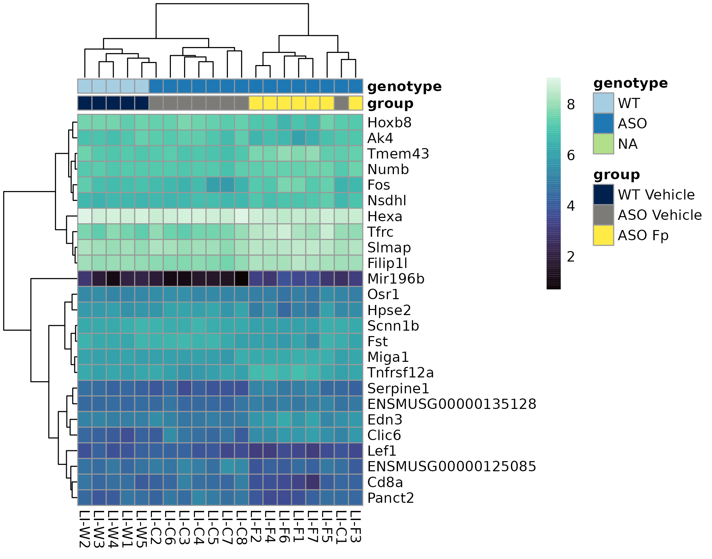

**Overview**

- Imports raw gene expression data and metadata into DESeq2 objects
- Performs differential expression analysis
- Visualizes results
- Performs enrichment analysis
- Saves results tables

## Methods

See exact packages below for versions. At a high level we use DESeq2 for differential expression analysis, clusterProfiler for enrichment analysis, and ggplot2 for visualization.

## Analysis Setup

Environment setup

```{r, setup, message = FALSE, warning = FALSE}
library(tidyverse)
library(DESeq2)
library(glue)
library(DT)
library(BiocParallel)
library(patchwork)
library(writexl)
library(tibble)
library(clusterProfiler)
library(enrichplot)
library(org.Mm.eg.db)
library(AnnotationDbi)
library(ggpubr)
library(vegan)
library(ggside)
library(pheatmap)
library(viridis)
library(RColorBrewer)

homedir <- "/central/groups/MazmanianLab/joeB"
wkdir <- glue("{homedir}/RNASEQ/fprau_bulk")
input_dir <- glue("{wkdir}/data/input")
interim_dir <- glue("{wkdir}/data/interim")
results_dir <- glue("{wkdir}/data/results")
fig_dir <- glue("{wkdir}/figures")
source(glue("{wkdir}/notebook/R_scripts/quick_enrich.R"))
gofigs <- glue("{fig_dir}/GO_enrichment")
godata <- glue("{interim_dir}/GO_enrichment")

BiocParallel::register(BiocParallel::MulticoreParam(6))
```

Generate folder layout

```{r, eval = FALSE}
dir.create(glue("{fig_dir}/DESeq2_VolcanoPlots"), showWarnings = FALSE, recursive = TRUE)
dir.create(glue("{fig_dir}/GO_enrichment"), showWarnings = FALSE, recursive = TRUE)
dir.create(glue("{fig_dir}/gene_expression_bxplots"), showWarnings = FALSE, recursive = TRUE)

dir.create(glue("{interim_dir}/GO_enrichment"), showWarnings = FALSE, recursive = TRUE)
dir.create(glue("{results_dir}"), showWarnings = FALSE, recursive = TRUE)
```


Prepping DESeq2 object

```{r, eval = TRUE}
# Loading metadata
meta <- read_csv(glue("{input_dir}/metadata_BulkRNASeq_Samples_AM.csv")) %>% 
  janitor::clean_names() %>% 
  mutate(genotype = case_when(
    genotype == "ASO" ~ "Thy1-ASO",
    TRUE ~ genotype
  )) %>% 
  mutate(group = glue("{genotype} {treatment}")) %>%
  mutate(group = factor(group, levels = c("WT Vehicle", "Thy1-ASO Vehicle", "Thy1-ASO Fp"))) %>%
  mutate_at(vars(extraction_date, collection_date), lubridate::mdy) %>%
  glimpse()

# color_pal <- color_pal
# group_order <- c("ASO Vehicle", "ASO Fp", "WT Vehicle")
color_pal <- c("Thy1-ASO Vehicle" = "#A6CEE3", "Thy1-ASO Fp" = "#1F78B4", "WT Vehicle" = "#B2DF8A")
group_order <- c("Thy1-ASO Vehicle", "Thy1-ASO Fp", "WT Vehicle")

# Examing the metadata
DT::datatable(meta)
```


**LARGE INTESTINE**

- cohort, cage, extraction date, collection date all might be useful covars

```{r}
# Loading gene expression data
# filtering for protein coding only genes trims file down from 78,298 to 21,748 features (all samples aggregated)
gex <- read_csv(glue("{input_dir}/20250416_ParkinsonsAVW_rawcounts.csv")) %>% 
  filter(gene_type == "protein_coding") %>% 
  glimpse()
gene_map <- gex %>% dplyr::select(gene_id, gene_name, gene_type) %>% distinct()
```


```{r, eval = FALSE}
gene_mat <- gex %>% 
  column_to_rownames(var = "gene_id") %>%
  dplyr::select(-c(gene_name, gene_type)) %>%
  as.matrix()

meta_gi <- meta %>% filter(tissue == "Large intestine") %>% 
  mutate_at(vars(genotype, treatment, cohort, cage_number), as.factor)
rownames(meta_gi) <- meta_gi$sample_id

# Creating DESeq2 object
# DeSeq2 is unable to fit the glm when more than one factor is included in the design
dds_gi <- DESeqDataSetFromMatrix(countData = gene_mat[,rownames(meta_gi)],
                              colData = meta_gi,
                              design = ~ group
                              )

```


Visualizing group mean expression vs cofficient of variation

```{r, eval = FALSE}
extract_group_mean_and_cv <- function(dds, group_col = NULL, group_value = NULL) {
  # If group_col and group_value are provided, filter samples
  if (!is.null(group_col) && !is.null(group_value)) {
    # Get sample names for the group
    samples <- rownames(colData(dds))[colData(dds)[[group_col]] == group_value]
    # Subset counts to those samples
    counts_mat <- DESeq2::counts(dds)[, samples, drop = FALSE]
  } else {
    counts_mat <- DESeq2::counts(dds)
  }
  group_mean <- rowMeans(counts_mat)
  group_cv <- apply(counts_mat, 1, function(x) sd(x) / mean(x))
  return(data.frame(ensembl_id = rownames(counts_mat), group_mean = group_mean, group_cv = group_cv))
}

mean_cv_gi <- unique(meta$group) %>% 
  purrr::set_names(.) %>% 
  purrr::map(~extract_group_mean_and_cv(dds_gi, "group", .x)) %>% 
  bind_rows(.id = "group") %>% 
  glimpse()

# Large Intestine plot with marginal densities
p_mean_cv_gi <- mean_cv_gi %>% 
  ggplot(aes(x = group_mean, y = group_cv)) +
  geom_point(alpha = 0.3, size = 0.6) +
  geom_xsidedensity(aes(y = after_stat(density))) +
  geom_ysidedensity(aes(x = after_stat(density))) +
  geom_smooth(method = "loess") +
  theme_bw() +
  scale_x_log10() +
  scale_y_log10() +
  facet_wrap(~group) +
  ggtitle("Large Intestine") +
  scale_ysidex_continuous(guide = guide_axis(angle = 90), minor_breaks = NULL) +
  scale_xsidey_continuous(minor_breaks = NULL) +
  theme(ggside.panel.scale.y = .2, 
        ggside.panel.scale.x = .2)

ggsave(p_mean_cv_gi, filename = glue("{fig_dir}/mean_cv_gi.png"), width = 12, height = 5)

```


::::{.grid}
:::{.g-col-12 .text-center}
{width="95%"}
:::
::::

**Takeaways - Mean Expression vs CV**

- Average gene expression distributions are very similar across all groups within a tissue while CV distributions are more variable by condition.
- In the Large Intestine, there is a noteable decrease in CV at higher expression levels in WT Vehicle compared to both ASO conditions. This is suggestive that there are some highly expressed genes that are more variable in ASO mice compared to WT.


Minor pre-filtering - removing genes with total sum across samples <= 10 counts

```{r, eval = FALSE}
nrow(dds_gi)
dds_gi <- dds_gi[rowSums(counts(dds_gi)) >= 10, ]
nrow(dds_gi)
# 21748 to 17668 genes remaining
```


## Differential Expression Analysis

Running DESeq2 will perform the following key steps:


- Estimation of size factors

- Estimation of dispersion

- Negative Binomial GLM fitting and Wald statistic

```{r, eval = FALSE}
dds_gi <- DESeq(dds_gi)
dds_gi
```


```{r, eval = FALSE}
comps <- tribble(
    ~numerator, ~denominator,
    "WT Vehicle", "Thy1-ASO Vehicle",
    "Thy1-ASO Fp", "WT Vehicle",
    "Thy1-ASO Fp", "Thy1-ASO Vehicle"
)

res_gi <- list()
for (i in 1:nrow(comps)) {
  vs <- glue("{comps$numerator[i]}_vs_{comps$denominator[i]}") %>% gsub(" ", "_", .)
    message(glue(
        "Calculating differential expression for ",
        "{comps$numerator[i]} vs {comps$denominator[i]}"
    ))
    res_gi[[vs]] <- results(
        dds_gi,
        contrast = c("group", comps$numerator[i], comps$denominator[i])
    )
}

saveRDS(dds_gi, glue("{interim_dir}/deseq2_gi_{Sys.Date()}.rds"))
saveRDS(res_gi, glue("{interim_dir}/deseq2_gi_res_{Sys.Date()}.rds"))

```


## Visualizing results

Reading in processed results
```{r, eval = FALSE}
dds_gi <- readRDS(glue("{interim_dir}/deseq2_gi_2025-07-24.rds"))
res_gi <- readRDS(glue("{interim_dir}/deseq2_gi_res_2025-07-24.rds"))
```


Visualzing p-value histograms

plotting funcs
```{r, eval = FALSE}
#' Plot p-value histogram
#' @param res DESeq2 results object
#' @return p-value histogram
plot_pval_hist <- function(res) {
  title = res@elementMetadata$description[5]
  res %>%
    as.data.frame() %>%
    ggplot(aes(x = pvalue)) +
    geom_histogram(binwidth = 0.01) +
    theme_minimal() +
    ggtitle(title)
}

#' Plot volcano plot
#' @param res DESeq2 results object
#' @return volcano plot
plot_volcano <- function(res, label_genes = NULL) {
    title <- res@elementMetadata$description[5]

    title <- res@elementMetadata$description[5] %>%
        strex::str_after_first("group ")
    numerator_group <- title %>% strex::str_before_first(" vs ")
    denominator_group <- title %>% strex::str_after_first(" vs ")
    color_pal <- c("#EF433D", "#06A0DD", "gray80")
    names(color_pal) <- c(
        glue("{numerator_group} Up"),
        glue("{denominator_group} Up"),
        "ns"
    )

    # Convert to dataframe and add gene symbols
    plot_df <- res %>%
        as.data.frame() %>%
        drop_na(padj) %>%
        rownames_to_column(var = "gene_id") %>%
        left_join(gene_map, by = "gene_id") %>%
        mutate(sig = case_when(
            padj <= 0.05 & log2FoldChange > 0.2 ~ glue("{numerator_group} Up"),
            padj <= 0.05 & log2FoldChange < -0.2 ~ glue("{denominator_group} Up"),
            TRUE ~ "ns"
        ))

    if (is.null(label_genes)) {
      # Identify top 10 genes by significance (lowest padj)
      top_genes <- plot_df %>%
        filter(sig !="ns") %>% 
          filter(padj < 0.05) %>%
          arrange(padj) %>%
          head(15)
    } else {
      top_genes <- plot_df %>%
          filter(gene_name %in% label_genes) %>%
          arrange(padj)
    }

    # Create the plot with labels
    ggplot(plot_df, aes(x = log2FoldChange, y = -log10(padj), color = sig)) +
        geom_point(alpha = 0.75) +
        theme_bw() +
        ggtitle(title) +
        scale_color_manual(values = color_pal) +
        theme(legend.position = "bottom") +
        theme(plot.title = element_text(hjust = 0.5)) +
        labs(color = NULL, y = expression(-log[10](padj)), x = expression(log[2](Fold~Change))) +
        geom_hline(yintercept = -log10(0.05), linetype = "dotted") +
        geom_vline(xintercept = 0.2, linetype = "dotted") +
        geom_vline(xintercept = -0.2, linetype = "dotted") +
        # Add ggrepel labels for top genes
        ggrepel::geom_text_repel(
            data = top_genes,
            aes(label = gene_name),
            size = 3,
            max.overlaps = Inf,
            force = 50,
            force_pull = 0,
            nudge_x = ifelse(top_genes$log2FoldChange > 0, 1, -1),
            nudge_y = 1,
            box.padding = 0.8,
            point.padding = 0.5,
            segment.color = "grey",
            segment.size = 0.2,
            segment.alpha = 0.75,
            direction = "both",
            # Add these parameters for curved segments:
            segment.curvature = 0.3, # Controls how curved the lines are (0 = straight)
            segment.ncp = 3, # Number of control points (higher = smoother curves)
            segment.angle = 10 # Angle of the curve
        )
}

#' To run in parallel with plotPCA - 
#' designed to copy default filtering of DESeq2::plotPCA
#' 
#' @param vsd DESeq2::vst object
#' @param intgroup column name in colData(vsd) to use for grouping
#' @param ntop number of top variable genes to use
#' @param method distance method for PERMANOVA
#' @param nperm number of permutations for PERMANOVA
run_adonis <- function(vsd, intgroup = "group", ntop = 500, method = "euclidean", nperm = 9999) {
  # Get top variable genes
  rv <- rowVars(assay(vsd))
  select <- order(rv, decreasing = TRUE)[seq_len(min(ntop, length(rv)))]

  # Transpose expression matrix (samples × genes)
  expr_mat <- t(assay(vsd)[select, ])

  # Extract metadata
  if (!intgroup %in% colnames(colData(vsd))) {
    stop("intgroup must be a column in colData(vsd)")
  }
  meta <- as.data.frame(colData(vsd)[, intgroup, drop = FALSE])
  colnames(meta) <- "Group"  # simplify formula building

  # Run PERMANOVA
  adonis2_result <- vegan::adonis2(
    expr_mat ~ Group, data = meta, method = method, permutations = nperm
    )

  return(adonis2_result)
}

#' Convert gene symbol to gene ID
#' @param gene_input gene symbol
#' @return gene ID
symbol_to_gene_id <- function(gene_input) {
  gene_id_vec <- gene_map %>% filter(gene_name == gene_input) %>% pull(gene_id)
  if (length(gene_id_vec) == 0) {
    stop(glue("Gene symbol '{gene_input}' not found in gene_map$gene_name"))
  }
  gene_id <- gene_id_vec[1] # In case there are duplicates, just take the first
  gene_id
}

#' Pull gene data from DESeq2 object
#' @param dds DESeq2 object
#' @param gene_input gene symbol
#' @param norm whether to normalize the data
#' @param gene_symbol whether to use gene symbol or gene ID
#' @return gene data
pull_gene_data <- function(dds, gene_input, norm = TRUE, gene_symbol = TRUE) {
  if (gene_symbol) {
    gene_id <- symbol_to_gene_id(gene_input)
  }
  gene_data <- DESeq2::counts(dds, normalized = norm)[gene_id, ]
  return(gene_data)
}

# #' Plot gene expression
# #' @param dds DESeq2 object
# #' @param gene_input gene symbol
# #' @param x_var variable to plot on x-axis
# #' @param norm whether to normalize the data
# #' @param gene_symbol whether to use gene symbol or gene ID
# #' @return plot
# plot_gene_expression <- function(dds, gene_input, x_var = "sample_id", norm = TRUE, gene_symbol = TRUE, ...) {
#   gene_data <- pull_gene_data(dds = dds, gene_input = gene_input, ...)
#   set.seed(123)
#   plot_df <- data.frame(expression = gene_data)  %>% 
#     rownames_to_column(var = "sample_id") %>% 
#     left_join(meta) %>% 
#     ggplot(aes(x = .data[[x_var]], y = expression, color = group)) +
#     geom_boxplot(outlier.shape = NA) +
#     geom_point(position = position_jitter(width = 0.2, height = 0)) +
#     labs(x = NULL, y = "Normalized Expression", color = NULL) +
#     scale_color_manual(values = color_pal) +
#     theme_bw() +
#     theme(axis.text.x = element_blank())
#   return(plot_df)

# }

#' Format p-value
#' @param x p-value
#' @return formatted p-value
format_pval <- function(x) {
  if (is.na(x)) {
    return("ns")
  } else if (x > 0.1) {
    return("ns")
  } else {
    return(formatC(x, format = "e", digits = 1))
  }
}

# #' Plot gene expression
# #' @param dds DESeq2 object
# #' @param gene_input gene symbol
# #' @param x_var variable to plot on x-axis
# #' @param norm whether to normalize the data
# #' @param gene_symbol whether to use gene symbol or gene ID
# #' @return plot
# plot_gene_expression <- function(dds, gene_input, x_var = "sample_id", norm = TRUE, gene_symbol = TRUE, pval_data, ...) {
#   gene_data <- pull_gene_data(dds = dds, gene_input = gene_input)
#   set.seed(123)  
#   max_y <- max(gene_data)
#   plot_df <- data.frame(expression = gene_data)  %>% 
#     rownames_to_column(var = "sample_id") %>% 
#     left_join(meta) %>% 
#     ggplot(aes(x = .data[[x_var]], y = expression, color = group)) +
#     geom_boxplot(outlier.shape = NA) +
#     geom_point(position = position_jitter(width = 0.2, height = 0)) +
#     labs(x = NULL, y = "Normalized Expression", color = NULL) +
#     scale_color_manual(values = color_pal) +
#     theme_bw() +
#     stat_pvalue_manual(
#       pval_data,
#       label = "p.adj",
#       y.position = c(max_y*1.1, max_y*1.2, max_y*1.3)
#     ) +
#     theme(axis.text.x = element_blank())
#   return(plot_df)
# }


```

### P-value Distributions

```{r, eval = FALSE}
p_hist_gi <- res_gi %>% 
  purrr::map(~plot_pval_hist(.x))

p_hist_gi_patch <- p_hist_gi %>% purrr::reduce(`/`) + plot_layout(ncol = 1)

ggsave(p_hist_gi_patch, 
  filename = glue("{fig_dir}/deseq2_gi_pval_hist.png"), width = 6, height = 10)

```


::::{.grid}
:::{.g-col-12 .text-center}
{width="95%"}
:::
::::


**Takeaways - P-value Distributions**

- P-value distributions are robust for Large Intestine.


### Dimension Reduction - PCA

```{r, eval = FALSE}
vsd_gi <- vst(dds_gi, blind=FALSE)

adonis_gi <- run_adonis(vsd_gi)

# #' PERMANOVA RESULTS
# > adonis_gi
# Permutation test for adonis under reduced model
# Terms added sequentially (first to last)
# Permutation: free
# Number of permutations: 9999

# vegan::adonis2(formula = expr_mat ~ Group, data = meta, permutations = nperm, method = method)
#          Df SumOfSqs      R2      F Pr(>F)    
# Group     2    894.9 0.24056 2.6925  1e-04 ***
# Residual 17   2825.3 0.75944                  
# Total    19   3720.2 1.00000                  
# ---
# Signif. co

# BiocGenerics::plotPCA(vsd_gi, intgroup=c("group")) # viewing explained variance numbers
p_pca_gi <- plotPCA(vsd_gi, intgroup=c("group"), returnData = TRUE) %>% 
  ggplot(aes(x = PC1, y = PC2, color = group)) +
  geom_point(size = 3) +
  theme_bw() +
  coord_fixed() +
  labs(x = "PC1: 25% variance", y = "PC2: 13% variance", color = NULL) +
  ggtitle("Large Intestine") +
  stat_ellipse(geom="polygon", level=0.95, alpha=0) +
  annotate(
    "text",
    x = Inf, y = 0,         # right side, center vertically
    hjust = 1.3, vjust = - 2, size = 3,
    label = glue(
      "PERMANOVA\nR² = {round(adonis_gi$R2[1], 2)}\n",
      "p = {formatC(adonis_gi$`Pr(>F)`[1], format = 'e', digits = 2)}"
    )
  ) +
  scale_color_manual(
    values = color_pal,
    limits = group_order
  )


ggsave(p_pca_gi, 
  filename = glue("{fig_dir}/deseq2_gi_pca.png"), width = 6, height = 5)

```


{width="95%"}


**Takeaways - PCA**

- PCA plots show some separation between conditions, but differences are modest. There is substantial similarity between a handful of some samples across conditions.


### Volcano Plots

```{r, eval = FALSE}
volcano_figs <- glue("{fig_dir}/DESeq2_VolcanoPlots")
dir.create(volcano_figs, showWarnings = FALSE, recursive = TRUE)

for (comp in names(res_gi)) {
  p_vol_gi <- res_gi[[comp]] %>% plot_volcano()
  ggsave(
      p_vol_gi,
      filename = glue("{volcano_figs}/GI_volcano_{comp}.png"),
      width = 5,
      height = 5
  )
}

# Highlighting specific genes of interest in Volcano Plots
gois <- c("Tnfrsf12a", "Hif1a", "Ccl5", "Prkci", "Edn3", 
  "Slc8a3", "Tfrc", "Tmem43", "Fos", "Cd8a", "Hoxb8")

# is.null(gois)

p_vol_gi <- res_gi[["Thy1-ASO_Fp_vs_Thy1-ASO_Vehicle"]] %>% plot_volcano(label_genes = gois)
ggsave(p_vol_gi, 
    filename = glue("{fig_dir}/DESeq2_VolcanoPlots/GI_volcano_Thy1-ASO_Fp_vs_Thy1-ASO_Vehicle_GOIs.png"), 
    width = 5, height = 5)

# res_gi[["Thy1-ASO_Fp_vs_Thy1-ASO_Vehicle"]] %>%
#         as.data.frame() %>%
#         drop_na(padj) %>%
#         rownames_to_column(var = "gene_id") %>%
#         left_join(gene_map, by = "gene_id") %>% 
#         filter(gene_name == "Tfrc")
        # mutate(sig = case_when(
        #     padj <= 0.05 & log2FoldChange > 0.2 ~ glue("{numerator_group} Up"),
        #     padj <= 0.05 & log2FoldChange < -0.2 ~ glue("{denominator_group} Up"),
        #     TRUE ~ "ns"
        # ))

```

::: {layout-nrow=1}


:::


Heatmap to visualize differences between conditions for main DEGS between ASO Fp vs ASO Vehicle and WT Vehicle vs ASO Vehicle

```{r, eval = FALSE}
heatmap_meta <- as.data.frame(colData(dds_gi)[,c("group", "genotype")])

# 1. Get top 25 DE genes from specific contrast
top_genes <- res_gi[["Thy1-ASO_Fp_vs_Thy1-ASO_Vehicle"]] %>%
  as.data.frame() %>%
  tibble::rownames_to_column("gene_id") %>%
  arrange(padj) %>%
  filter(!is.na(padj)) %>%
  slice_head(n = 20) %>%
  pull(gene_id)

# 2. Replace Ensembl IDs with gene symbols
gene_map_clean <- gene_map %>%
  mutate(gene_id = sub("\\..*", "", gene_id))  # Remove version suffix
top_genes_clean <- sub("\\..*", "", top_genes)
gene_symbols <- gene_map_clean %>%
  filter(gene_id %in% top_genes_clean) %>%
  distinct(gene_id, gene_name)
# Ensure rownames match the matrix rownames
mat <- assay(dds_gi)[top_genes, ] %>% log1p()  # 2. log-scale
# 1. Rename rownames to gene symbols
rownames(mat) <- gene_symbols$gene_name[match(sub("\\..*", "", rownames(mat)), gene_symbols$gene_id)]

# Define custom annotation colors
annotation_colors <- list(
  genotype = c("WT" = "#A6CEE3", "Thy1-ASO" = "#1F78B4"),
  group = setNames(viridis(length(unique(heatmap_meta$group)), option = "E"),  # D is default viridis
                   unique(heatmap_meta$group))
)

# Plot with magma color scale
pheat <- pheatmap(
  mat,
  cluster_rows = TRUE,
  cluster_cols = TRUE,
  show_rownames = TRUE,
  annotation_col = heatmap_meta,
  annotation_colors = annotation_colors,
  color = viridis::viridis(100, option = "mako")
)

ggsave(pheat, filename = glue("{fig_dir}/heatmap_gi_top_genes.png"), width = 7, height = 5.5)

```


{width="95%"}


Visualzing similarities in gene expression shifts between conditions

```{r, eval = FALSE}
# names(res_gi)
wt_v_asoc <- res_gi[["WT_Vehicle_vs_Thy1-ASO_Vehicle"]] %>% 
  as.data.frame() %>% 
  mutate(sig = case_when(
    padj <= 0.05 & log2FoldChange > 0.2 ~ "Up",
    padj <= 0.05 & log2FoldChange < -0.2 ~ "Down",
    TRUE ~ "ns"
  )) %>% 
  dplyr::rename_all( ~ paste0(., "__wt_v_asoc")) %>% 
  rownames_to_column(var = "gene_id")
asofp_v_asoc <- res_gi[["Thy1-ASO_Fp_vs_Thy1-ASO_Vehicle"]] %>% 
  as.data.frame() %>% 
  mutate(sig = case_when(
    padj <= 0.05 & log2FoldChange > 0.2 ~ "Up",
    padj <= 0.05 & log2FoldChange < -0.2 ~ "Down",
    TRUE ~ "ns"
  )) %>% 
  dplyr::rename_all( ~ paste0(., "__asofp_v_asoc")) %>% 
  rownames_to_column(var = "gene_id")


df_comb <- full_join(wt_v_asoc, asofp_v_asoc) %>% 
  left_join(gene_map, by = "gene_id") %>% 
  mutate(sig_comb = case_when(
    sig__wt_v_asoc == "Up" & sig__asofp_v_asoc == "Up" ~ "WT & ASO Fp Up",
    sig__wt_v_asoc == "Down" & sig__asofp_v_asoc == "Down" ~ "WT & ASO Fp Down",
    TRUE ~ "Mixed"
  )) %>% 
  drop_na(pvalue__wt_v_asoc, pvalue__asofp_v_asoc) %>% 
  glimpse()

df_comb$sig_comb %>% table()
top_genes <- df_comb %>%
  filter(sig_comb != "Mixed")
df_comb %>% glimpse()

color_pal <- c("#EF433D", "#06A0DD", "gray80")
names(color_pal) <- c("WT & ASO Fp Up", "WT & ASO Fp Down", "Mixed")

set.seed(123)
p_comb <- df_comb %>%
  drop_na(log2FoldChange__wt_v_asoc, log2FoldChange__asofp_v_asoc) %>%
  # Reorder the factor levels to make "Mixed" appear first (below other points)
  mutate(sig_comb = factor(sig_comb, levels = c("Mixed", "WT & ASO Fp Up", "WT & ASO Fp Down"))) %>%
  arrange(sig_comb) %>% 
  ggplot(aes(x = log2FoldChange__wt_v_asoc, y = log2FoldChange__asofp_v_asoc)) +
  geom_point(aes(color = sig_comb), alpha = 0.75) +
  # geom_abline(slope = 1, linetype = "dotted") +  # y ~ x line
  # geom_abline(slope = -1, linetype = "dotted") +  # y ~ -x line
  scale_color_manual(values = color_pal) +
  labs(
    color = NULL,
    x = expression(log[2](Fold~Change[WT~Vehicle~vs~ASO~Vehicle])),
    y = expression(log[2](Fold~Change[ASO~Fp~vs~ASO~Vehicle])),
    color = NULL
  ) +
  geom_smooth(method = "lm", se = TRUE, color = "black") +
  ggpubr::stat_cor(
     aes(label = paste(..r.label.., ..p.label.., sep = "~`,`~")),
    method = "pearson", label.x = -5, label.y = 5, na.rm = TRUE
    ) +
  ggrepel::geom_label_repel(
    data = top_genes,
    aes(label = gene_name, color = sig_comb),
    size = 3,
    max.overlaps = Inf,
    force = 0.3,
    force_pull = 0,
    nudge_x = ifelse(top_genes$log2FoldChange > 0, 1, -1),
    nudge_y = 1,
    box.padding = 0.8,
    point.padding = 0.5,
    segment.color = "black",
    segment.size = 0.2,
    segment.alpha = 0.6,
    direction = "both",
    # Add these parameters for curved segments:
    segment.curvature = 0.3, # Controls how curved the lines are (0 = straight)
    segment.ncp = 3, # Number of control points (higher = smoother curves)
    segment.angle = 10 # Angle of the curve
) +
  coord_fixed() +
  theme_bw()

ggsave(
  p_comb,
  filename = glue("{fig_dir}/cross_condition_L2fc_scatter.png"),
  width = 7,
  height = 5
)

ggsave(
  p_comb,
  filename = glue("{fig_dir}/cross_condition_L2fc_scatter.svg"),
  width = 7,
  height = 5
)

```


{width="95%"}

**Takeaways - Cross Condition L2FC Scatter**

- Cross condition L2FC scatter plot highlights a handful of genes that are enriched in two comparisons of interest in the same direction. 1 - Up in WT compared to ASO Vehicle, 2 - Up in ASO Fp compared to ASO Vehicle. We correlated the log2fc of all genes retained in the DESeq2 analysis and observe a significant positive correlation between the two conditions - suggesting that F. prausnitzii treatment in ASO shifts the large intestine expression profile towards the WT Vehicle profile with respect to an altered ASO Vehicle background. Points that are colored pass significance in both comparisons are highlighted with a label.


## Visualizing expression of a few genes of interest

```{r, eval = FALSE}
# gene_id <- "Ttr"
# symbol_to_gene_id("Apob")
# pull_gene_data(dds = dds_gi, gene_input = "Apob")
p <- plot_gene_expression(dds = dds_gi, gene_input = "Apob", x_var = "group")
ggsave(glue("{fig_dir}/gene_expression_bxplots/Apob_GI.png"), p, width = 5, height = 4)

p <- plot_gene_expression(dds = dds_gi, gene_input = "Snca", x_var = "group")
ggsave(glue("{fig_dir}/gene_expression_bxplots/Snca_GI.png"), p, width = 5, height = 4)

p <- plot_gene_expression(dds = dds_gi, gene_input = "Thy1", x_var = "group")
ggsave(glue("{fig_dir}/gene_expression_bxplots/Thy1_GI.png"), p, width = 5, height = 4)

p <- plot_gene_expression(dds = dds_gi, gene_input = "Pcdh11x", x_var = "group")
ggsave(glue("{fig_dir}/gene_expression_bxplots/Pcdh11x_GI.png"), p, width = 5, height = 4)


gois <- c("Tnfrsf12a", "Hif1a", "Ccl5", "Prkci", "Edn3", 
  "Slc8a3", "Tfrc", "Tmem43", "Fos", "Cd8a", "Hoxb8")

for (g in gois) {
  message(glue("Plotting {g}"))
  pval_df <- data.frame(
    group1 = c("WT Vehicle", "Thy1-ASO Fp", "Thy1-ASO Vehicle"),
    group2 = c("Thy1-ASO Vehicle", "WT Vehicle", "Thy1-ASO Fp"),
    p.adj = c(
      res_gi[["WT_Vehicle_vs_Thy1-ASO_Vehicle"]][symbol_to_gene_id(g), "padj"] %>% format_pval(),
      res_gi[["Thy1-ASO_Fp_vs_WT_Vehicle"]][symbol_to_gene_id(g), "padj"] %>% format_pval(),
      res_gi[["Thy1-ASO_Fp_vs_Thy1-ASO_Vehicle"]][symbol_to_gene_id(g), "padj"] %>% format_pval()
    )
  )
  p <- plot_gene_expression(dds = dds_gi, gene_input = g, x_var = "group", pval_data = pval_df)
  ggsave(glue("{fig_dir}/gene_expression_bxplots/GOIs/{g}_GI.png"), p, width = 4, height = 4)
}

#' Plot gene expression
#' @param dds DESeq2 object
#' @param gene_input gene symbol
#' @param x_var variable to plot on x-axis
#' @param norm whether to normalize the data
#' @param gene_symbol whether to use gene symbol or gene ID
#' @return plot
plot_gene_expression <- function(dds, gene_input, x_var = "sample_id", norm = TRUE, gene_symbol = TRUE, pval_data, ...) {
  gene_data <- pull_gene_data(dds = dds, gene_input = gene_input)
  set.seed(123)  
  max_y <- max(gene_data)
  plot_df <- data.frame(expression = gene_data)  %>% 
    rownames_to_column(var = "sample_id") %>% 
    left_join(meta) %>% 
    ggplot(aes(x = .data[[x_var]], y = expression, color = group)) +
    geom_boxplot(outlier.shape = NA) +
    geom_point(position = position_jitter(width = 0.2, height = 0)) +
    labs(x = NULL, y = "Normalized Expression", color = NULL, title = gene_input) +
    scale_color_manual(values = color_pal) +
    theme_bw() +
    stat_pvalue_manual(
      pval_data,
      label = "p.adj",
      segment.length = 0.05,
      y.position = c(max_y*1.0, max_y*1.1, max_y*1.2)
    ) +
    theme(axis.text.x = element_blank(), 
          plot.title = element_text(hjust = 0.5, size = 10),
          axis.ticks.x = element_blank())
  return(plot_df)
}


```


## Enrichment Analysis

```{r, eval = FALSE}
# dir.create(godata, showWarnings = FALSE, recursive = TRUE)

# tst <- c("WT_Vehicle_vs_ASO_Vehicle", "ASO_Fp_vs_WT_Vehicle", "Thy1-ASO_Fp_vs_Thy1-ASO_Vehicle")
for (ont_type in c("BP")) {
  for (comp in names(res_gi)) {
    message(glue("Running enrichment analysis for {comp}"))  
    numerator <- comp %>% strex::str_before_first("_vs")
    denominator <- comp %>% strex::str_after_first("vs_")
    enrich_out_gi_numerator_up <- run_GO_enrich(
      res = res_gi[[comp]],
      alpha = 0.1,
      lfc = 0.2,
      ont = ont_type,
      top_n = 20,
      log2fc_direction = "up",
      plot_file = glue("{gofigs}/GO_dotplot_GI_{comp}__{numerator}_UP_{ont_type}.png")
    )
    saveRDS(enrich_out_gi_numerator_up, glue("{godata}/enrich_out_GI_{comp}__{numerator}_UP_{ont_type}_{Sys.Date()}.rds"))
    
    enrich_out_gi_numerator_down <- run_GO_enrich(
      res = res_gi[[comp]],
      alpha = 0.1,
      lfc = 0.2,
      ont = ont_type,
      top_n = 20,
      log2fc_direction = "down",
      plot_file = glue("{gofigs}/GO_dotplot_GI_{comp}__{denominator}_UP_{ont_type}.png")
    )
    saveRDS(enrich_out_gi_numerator_down, glue("{godata}/enrich_out_GI_{comp}__{denominator}_UP_{ont_type}_{Sys.Date()}.rds"))
    
    # enrich_out_mb_numerator_up <- run_GO_enrich(
    #   res = res_mb[[comp]],
    #   alpha = 0.1,
    #   lfc = 0.2,
    #   ont = ont_type,
    #   top_n = 20,
    #   log2fc_direction = "up",
    #   plot_file = glue("{gofigs}/GO_dotplot_MB_{comp}__{numerator}_UP_{ont_type}.png")
    # )
    # saveRDS(enrich_out_mb_numerator_up, glue("{godata}/enrich_out_MB_{comp}__{numerator}_UP_{ont_type}_{Sys.Date()}.rds"))
    
    # enrich_out_mb_numerator_down <- run_GO_enrich(
    #   res = res_mb[[comp]],
    #   alpha = 0.1,
    #   lfc = 0.2,
    #   ont = ont_type,
    #   top_n = 20,
    #   log2fc_direction = "down",
    #   plot_file = glue("{gofigs}/GO_dotplot_MB_{comp}__{denominator}_UP_{ont_type}.png")
    # )
    # saveRDS(enrich_out_mb_numerator_down, glue("{godata}/enrich_out_MB_{comp}__{denominator}_UP_{ont_type}_{Sys.Date()}.rds"))

  }
}

# for (ont_type in c("BP")) {
#   for (comp in names(res_gi)) {
#     message(glue("Running enrichment analysis for {comp}"))  
#     enrich_out_gi <- run_GO_enrich(
#       res = res_gi[[comp]],
#       alpha = 0.1,
#       lfc = 0.2,
#       ont = ont_type,
#       top_n = 20,
#       plot_file = glue("{gofigs}/GO_dotplot_GI_{comp}_{ont_type}.png")
#     )
#     saveRDS(enrich_out_gi, glue("{godata}/enrich_out_GI_{comp}_{ont_type}_{Sys.Date()}.rds"))
    
#     enrich_out_mb <- run_GO_enrich(
#       res = res_mb[[comp]],
#       alpha = 0.1,
#       lfc = 0.2,
#       ont = ont_type,
#       top_n = 20,
#       plot_file = glue("{gofigs}/GO_dotplot_MB_{comp}_{ont_type}.png")
#     )
#     saveRDS(enrich_out_mb, glue("{godata}/enrich_out_MB_{comp}_{ont_type}_{Sys.Date()}.rds"))

#   }
# }

```


**Large Intestine**

::: {layout-nrow=1}


:::


**Takeaways - GO Enrichment**

- GO enrichment analysis shows robust hits for the Large Intestine. 

- GO analysis of the large intenstine show some interesting results - 
  1) the ASO Fp vs ASO Vehicle contrast (left panel) is enriched for actin-filament organisation, wound healing, skeletal morphogenesis and cartilage development, pointing to cytoskeletal re-arrangement and tissue-repair pathways rather than immune activation. This suggests that the F. prausnitzii ASO is inducing a "healing" response.
  2) Immune pathways dominate whenever the WT background is involved – both contrasts that include WT animals (centre and right panels) rank lymphocyte activation/differentiation, leukocyte migration, and regulation of immune-system processes at the very top, indicating that genotype (WT vs ASO) is primarily distinguished by immune gene programmes.
  3) The WT Vehicle vs ASO Vehicle comparison shows the strongest proportional shift – its GeneRatio values climb to ~0.09 (higher than the ≤ 0.06 seen in the other two plots), suggesting that baseline genetic difference out-weighs Fp treatment in terms of the fraction of genes hitting each GO term.
  4) Cell–cell adhesion appears as a shared immune theme, absent from the Fp-only contrast – terms such as "regulation of cell-cell adhesion" and "leukocyte cell–cell adhesion" recur in the two immune-heavy panels but not in the Fp-vehicle panel, underscoring that adhesion/trafficking of immune cells is a WT/ASO signature rather than a direct consequence of Fp treatment.


Making a nicer figure for the GO enrichment analysis

```{r, eval = FALSE}
go_res <- readRDS(glue("{godata}/enrich_out_GI_ASO_Fp_vs_ASO_Vehicle__ASO_Fp_UP_BP_2025-07-22.rds"))

p_fp_up <- go_res$plot +
  ggtitle("GO enrichment (ASO Fp Up-regulated vs ASO Control)") +
  labs(color = "p-adjusted") +
  theme(plot.title = element_text(hjust = 0.5))

ggsave(
  p_fp_up,
  filename = glue("{gofigs}/FIGURE_GO_dotplot_GI_ASO_Fp_vs_ASO_Vehicle__ASO_Fp_UP_BP_2025-07-22.png"),
  width = 7,
  height = 7
)

go_res_fpdown <- readRDS(glue("{godata}/enrich_out_GI_ASO_Fp_vs_ASO_Vehicle__ASO_Vehicle_UP_BP_2025-07-22.rds"))

p_fp_down <- go_res_fpdown$plot +
  ggtitle("GO enrichment (ASO Control Up-regulated vs ASO Fp)") +
  labs(color = "p-adjusted") +
  theme(plot.title = element_text(hjust = 0.5))

ggsave(
  p_fp_down,
  filename = glue("{gofigs}/FIGURE_GO_dotplot_GI_ASO_Fp_vs_ASO_Vehicle__ASO_Vehicle_UP_BP_2025-07-22.png"),
  width = 7,
  height = 7
)

# go_res$results %>% 
#   as.data.frame() %>% 
#   glimpse()

```


## Saving Results Tables

```{r, eval = FALSE}
# Convert DESeq2 results to data frame
format_results_df <- function(res) {
  df <- res %>% 
    as.data.frame() %>%
    rownames_to_column(var = "gene_id") %>% 
    left_join(gene_map, by = "gene_id") %>%
    glimpse()
  return(df)
}

gi_res_list <- res_gi %>% purrr::map(~format_results_df(.x))

# Write to Excel file
write_xlsx(gi_res_list, path = glue("{results_dir}/DESeq2_GI_results.xlsx"))

# Saving GO enrichment results
godata_files <- list.files(godata, full.names = TRUE, pattern = "2025-07-22.rds") %>% 
  keep(~grepl("_UP_", .x))

godata_list <- godata_files %>% 
  purrr::set_names(basename(.)%>% 
    gsub("enrich_out_|_2025-07-22.rds", "", .)) %>% 
  purrr::imap(~readRDS(.x)$results %>% 
    as.data.frame() %>% 
    mutate(direction = .y  %>% strex::str_after_first("__"))
  )

names(godata_list) <- names(godata_list) %>% strex::str_before_first("__")

# Convert list of lists to a single data frame
write_xlsx(godata_list, path = glue("{results_dir}/GO_enrichment_results.xlsx"))

```


**Takeaways - ALL**

- P-value distributions are robust for Large Intestine.
- PCA plots show some separation between conditions, but differences are modest. There is substantial similarity between a handful of some samples across conditions.
- Volcano plots show robust differences between groups of interest in the Large Intestine.
- Cross condition L2FC scatter plot highlights a handful of genes that are enriched in two comparisons of interest in the same direction. 1 - Up in WT compared to ASO Vehicle, 2 - Up in ASO Fp compared to ASO Vehicle. We correlated the log2fc of all genes retained in the DESeq2 analysis and observe a significant positive correlation between the two conditions - suggesting that F. prausnitzii treatment in ASO shifts the large intestine expression profile towards the WT Vehicle profile with respect to an altered ASO Vehicle background.
- GO enrichment analysis shows robust hits for the Large Intestine. 
- GO analysis of the large intenstine show some interesting results - 
  1) the ASO Fp vs ASO Vehicle contrast (left panel) is enriched for actin-filament organisation, wound healing, skeletal morphogenesis and cartilage development, pointing to cytoskeletal re-arrangement and tissue-repair pathways rather than immune activation. This suggests that the F. prausnitzii ASO is inducing a "healing" response.
  2) Immune pathways dominate whenever the WT background is involved – both contrasts that include WT animals (centre and right panels) rank lymphocyte activation/differentiation, leukocyte migration, and regulation of immune-system processes at the very top, indicating that genotype (WT vs ASO) is primarily distinguished by immune gene programmes.
  3) The WT Vehicle vs ASO Vehicle comparison shows the strongest proportional shift – its GeneRatio values climb to ~0.09 (higher than the ≤ 0.06 seen in the other two plots), suggesting that baseline genetic difference out-weighs Fp treatment in terms of the fraction of genes hitting each GO term.
  4) Cell–cell adhesion appears as a shared immune theme, absent from the Fp-only contrast – terms such as "regulation of cell-cell adhesion" and "leukocyte cell–cell adhesion" recur in the two immune-heavy panels but not in the Fp-vehicle panel, underscoring that adhesion/trafficking of immune cells is a WT/ASO signature rather than a direct consequence of Fp treatment.


## Environment Info

```{r, eval = TRUE}
sessionInfo()
```

